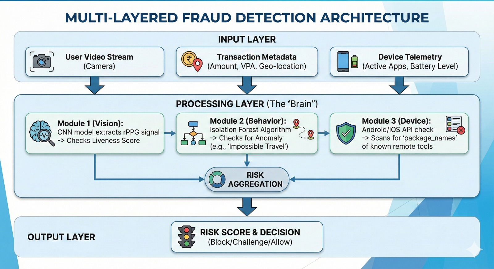

# Cyber Threat Detection Systems (Financial Ecosystem Focus)

Team Name: Beginners  
Team Leader: Theam  

---

## Problem Statement

India’s rapidly growing digital payment ecosystem is facing a “Trust Crisis”, especially impacting the Common Man and Rural Communities.

Major Threat Vectors:
- Digital Arrest & Mule Networks  
- UPI “Push” Fraud and Screen Monitoring  
- AePS Biometric Spoofing (Silicone Thumb Attack)  

These threats exploit authentication gaps, user awareness issues, and device-level vulnerabilities.

---

## Proposed Solution: Bio-Guard 360

Bio-Guard 360 is a unified, real-time threat detection Software Development Kit (SDK) for banking and fintech applications.

It integrates:
- Behavioral Biometrics  
- rPPG Liveness Detection  
- On-Device Machine Learning  

### Core Philosophy

Move from:

Authentication → “Is the password correct?”

to

Validation → “Is the user behaving normally and is this a real human?”

---

## Key Differentiators

### Passive Liveness Detection
Detects deepfakes and spoofing without requiring users to blink, turn their head, or perform active gestures.

### Privacy-First Architecture
All analysis happens on-device. No sensitive screen data is transmitted to the cloud.

### Real-Time Fraud Prevention
Fraud is blocked before the transaction occurs rather than detected after financial loss.

---

## System Architecture

Replace the image path below with your actual architecture diagram filename.

Example:

