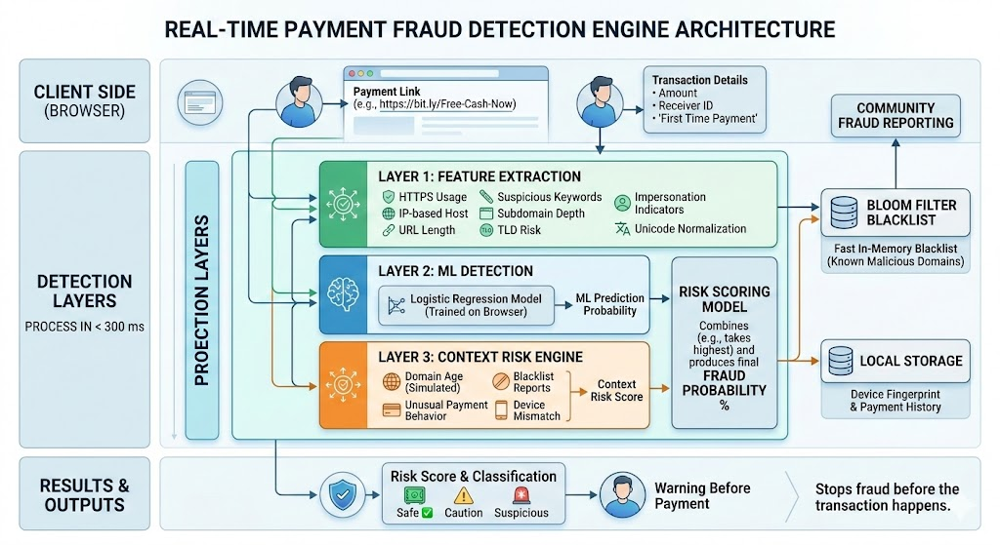

# Real-Time Payment Fraud Detection Engine

A lightweight browser-based fraud detection system that analyzes payment links **before money is sent**.
The system evaluates URLs, domain behavior, and user context to detect phishing and scam payment links in **under 300 ms**.

This project was built to demonstrate how modern fraud prevention systems combine **machine learning, rule-based detection, and behavioral signals** to stop fraud **before the transaction happens**.

---

# Overview

Online payment fraud often happens through fake payment links, phishing domains, and impersonated payment services. Most systems detect fraud **after money has already moved**.

This project focuses on **preventing fraud in real time** by evaluating payment links at the moment a user attempts to make a payment.

The system analyzes:

* URL structure
* Domain reputation
* Phishing indicators
* Behavioral transaction signals
* User device patterns

It then produces a **risk score** and warns the user before the payment proceeds.

---

# Key Features

### Real-Time Fraud Scoring

Evaluates payment links instantly and produces a **risk probability score**.

### Machine Learning Detection

Uses a lightweight **logistic regression model** trained directly in the browser to classify suspicious links.

### Phishing Detection

Detects common phishing patterns such as:

* Brand impersonation
* Suspicious keywords
* Deep subdomains
* Unusual URL structures

### Homoglyph Attack Detection

Normalizes Unicode characters to detect domains designed to look like legitimate services.

Example:

paypal.com vs paypa1.com

---

### Suspicious Domain Detection

Flags domains using high-risk top level domains such as:

* .xyz
* .zip
* .loan
* .click

---

### URL Shortener Detection

Detects shortened URLs commonly used to hide phishing links.

Examples:

* bit.ly
* tinyurl.com
* t.co

---

### Bloom Filter Blacklist

A fast in-memory blacklist using a **Bloom Filter** to track known malicious domains.

Advantages:

* Very fast lookup
* Low memory usage
* Suitable for client-side applications

---

### Community Fraud Reporting

Users can report malicious links.
Reported domains are automatically added to the blacklist and treated as high risk in future checks.

---

### Context-Aware Risk Signals

The system evaluates behavioral patterns during the transaction.

Examples include:

**First-time payment detection**

If the user has never paid this receiver before.

**Unusual transaction amount**

Compares the payment amount to historical payments for the same receiver.

**Device mismatch detection**

Detects when the payment request is initiated from a different device fingerprint.

---

### Risk Classification

The engine produces a risk percentage and classifies links as:

Safe
Caution
Suspicious

Users are warned when risk exceeds the threshold.

---

# System Architecture

The fraud engine combines three detection layers.

### 1. Feature Extraction

The system extracts multiple features from the URL including:

* HTTPS usage
* IP based hosts
* URL length
* suspicious keywords
* domain structure
* subdomain depth
* TLD risk
* impersonation indicators

---

### 2. Machine Learning Layer

A logistic regression model analyzes extracted features and produces a probability score.

Training data includes both legitimate and malicious payment links.

---

### 3. Context Risk Engine

Additional contextual signals increase risk scores:

* domain age
* blacklist reports
* unusual payment behavior
* device mismatch

---

# Risk Scoring Model

Final risk probability combines:

Machine Learning Prediction
plus
Context Risk Score

The highest value is used as the final fraud probability.

---

# Example Fraud Links Detected

The system correctly flags examples such as:

http://paypal.com.evil.co/login

https://bit.ly/Free-Cash-Now

https://google.com-verify-pay.com

http://192.168.1.10/pay

---

# Installation

Clone the repository

```
git clone https://github.com/yourusername/payment-fraud-detector.git
```

Navigate to the project directory

```
cd payment-fraud-detector
```

Open the project in a browser

```
index.html
```

No backend or dependencies are required.

---

# Project Structure

```
project
│
├── index.html
├── style.css
├── script.js
└── README.md
```

index.html
User interface for entering payment links.

style.css
UI styling.

script.js
Fraud detection engine and logic.

README.md
Project documentation.

---

# Example Usage

1. Enter a payment link.

Example:

```
https://bit.ly/Free-Cash-Now
```

2. Enter transaction details

Amount
Receiver ID
First time payment

3. Click **Check Link**

4. The system analyzes the URL and displays:

Risk score
Fraud signals
Security warnings

---

# Technologies Used

* JavaScript
* HTML
* CSS
* Logistic Regression (Client-side)
* Bloom Filters
* Local Storage

---

# Security Techniques Used

The project demonstrates multiple fraud detection techniques used in real systems.

URL analysis
Phishing detection
Domain reputation analysis
Machine learning classification
Behavioral fraud signals
Client-side blacklist tracking

---

# Limitations

This project is a prototype designed for demonstration purposes.

* Domain age data is simulated
* Small training dataset
* No real threat intelligence feeds

In production systems these components would be replaced with:

* large phishing datasets
* real-time threat feeds
* server-side ML models
* payment network integration

---

# Future Improvements

Potential improvements include:

* Google Safe Browsing API integration
* Larger ML training datasets
* Graph based scam network detection
* QR payment fraud detection
* Browser extension integration
* Real-time threat intelligence feeds

---

# Use Cases

This system could be used in:

Digital wallets
Banking apps
Payment gateways
Browser security extensions
Fintech fraud detection systems

---

# License

MIT License

---

# Author

Developed as a prototype demonstrating **real-time payment fraud detection techniques**.
markdown

